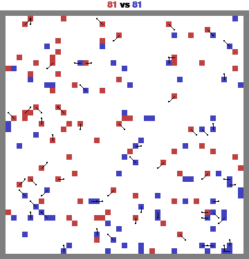

# MAgent2 RL Final Project

## Overview
In this project, you will develop and train a reinforcement learning (RL) agent using the MAgent2 platform to solve the `battle` environment. The goal is to create a competitive agent capable of performing well against three distinct types of opponents:

1. **Random Agents**: These agents take random actions within the environment.
2. **A Pretrained Agent**: A pretrained agent provided in the repository (`red.pt`).
3. **A Final Agent**: A stronger pretrained agent, which will be released in the final week of the course before the project deadline.

Your agent's performance will be assessed based on two metrics:
- **Reward**: Total reward accumulated by your agent during the battles.
- **Win Rate**: The win rate against the three opponent types.

You will primarily control *blue* agents during evaluation.

<p align="center">
  
  
  
</p>

You can explore the `video/` folder for demos showing how the agents behave in the following configurations:
- **Blue vs Random**: A trained blue agent faces off against random agents.
- **Blue vs Pretrained Red**: A trained blue agent competes with a pretrained red agent.
- **Blue vs Blue**: Two trained blue agents challenge each other.

## Installation & Running the Repository

To set up and run the project, follow the instructions below.

### Local Setup (VSCode or other local IDE)

1. Install the necessary dependencies:
    ```bash
    pip uninstall pettingzoo
    pip install -r requirements.txt
    ```

2. Execute the script to start the training or evaluation:
    ```bash
    python main.py
    ```

### Google Colab Setup

To run the project on Google Colab, follow these steps:

1. Install the required dependencies:
    ```bash
    !pip uninstall pettingzoo
    !pip install -r requirements.txt
    ```

2. Change the directory to the project folder and run the script:
    ```bash
    %cd Magent2-RL
    !python main.py
    ```

## Training a New Agent

To train your own agent with custom hyperparameters, you can pass them as command-line arguments using `argparse`. Here's an example:

```bash
python train_blue.py 
```

The following parameters are available for tuning:
- `--gamma`: Discount factor for future rewards (default: 0.99)
- `--learning_rate`: Learning rate for the optimizer (default: 1e-4)
- `--batch_size`: Size of the training batches (default: 64)
- `--buffer_size`: Replay buffer size (default: 100000)
- `--epsilon_start`: Starting epsilon for epsilon-greedy policy (default: 1.0)
- `--epsilon_end`: Ending epsilon for epsilon-greedy policy (default: 0.1)
- `--epsilon_decay`: Decay rate for epsilon (default: 0.995)
- `--target_update_freq`: Frequency of target network updates (default: 1000)
- `--max_episodes`: Maximum number of training episodes (default: 100)
- `--max_steps`: Maximum number of steps per episode (default: 1000)
- `--save_path`: Path to save the trained model (default: `pretrained/blue.pt`)

The script will start the training process and save the trained model after every 100 episodes.

## Output Videos and GIFs

After running the simulations, the results will be saved as MP4 and GIF files. These can be found in the `video/` and `assets/` folders. The following output files are generated:

1. **blue_vs_random.mp4** and **blue_vs_random.gif**: A blue agent versus random agents.
2. **blue_vs_red.mp4** and **blue_vs_red.gif**: A blue agent versus a pretrained red agent.
3. **blue_vs_blue.mp4** and **blue_vs_blue.gif**: Two trained blue agents competing against each other.

These videos and GIFs offer a visual representation of how your agent performs during each battle.

## References

- [MAgent2 GitHub Repository](https://github.com/Farama-Foundation/MAgent2)
- [MAgent2 API Documentation](https://magent2.farama.org/introduction/basic_usage/)

For more information about environment setup, agent interactions, and advanced usage, please refer to the official MAgent2 documentation.
