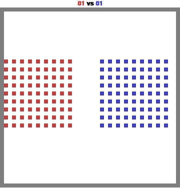

# MAgent2 RL Final Project
## Overview
In this final project, you will develop and train a reinforcement learning (RL) agent using the MAgent2 platform. The task is to solve a specified MAgent2 environment `battle`, and your trained agent will be evaluated on all following three types of opponents:

1. Random Agents: Agents that take random actions in the environment.
2. A Pretrained Agent: A pretrained agent provided in the repository.
3. A Final Agent: A stronger pretrained agent, which will be released in the final week of the course before the deadline.

Your agent's performance should be evaluated based on reward and win rate against each of these models. You should control *blue* agents when evaluating.

<p align="center">   </p> <p align="center"> <em>Left: red.pt vs IQL, Right: red_final.pt vs IQL</em> </p>

See `video` folder for a demo of how each type of opponent behaves.
Checkout the [Colab notebook](https://colab.research.google.com/drive/1qmx_NCmzPlc-atWqexn2WueqMKB_ZTxc) for running this demo.

## How to run
Checkout the [PIPELINE](https://colab.research.google.com/drive/1YBfdcZdRyzDQCIqgf8Ed3rUC_h9D0LqM) for a comprehensive overview of running the agent in the MAgent2 environment.

## Installation
clone this repo and install with
```
pip install -r requirements.txt
```

## Demos
See `main.py` for a starter code.

## Evaluation
Refer to `eval.py` for the evaluation code, you might want to modify it with your specific codebase.

## References

1. [MAgent2 GitHub Repository](https://github.com/Farama-Foundation/MAgent2)
2. [MAgent2 API Documentation](https://magent2.farama.org/introduction/basic_usage/)

For further details on environment setup and agent interactions, please refer to the MAgent2 documentation.
