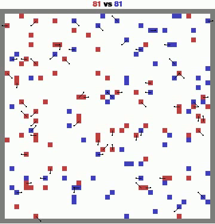

# MAgent2 RL Final Project
## Overview
In this final project, you will develop and train a reinforcement learning (RL) agent using the MAgent2 platform. The task is to solve a specified MAgent2 environment `battle`, and your trained agent will be evaluated on all following three types of opponents:

1. Random Agents: Agents that take random actions in the environment.
2. A Pretrained Agent: A pretrained agent provided in the repository.
3. A Final Agent: A stronger pretrained agent, which will be released in the final week of the course before the deadline.

Your agent's performance should be evaluated based on reward and win rate against each of these models. You should control *blue* agents when evaluating.


<p align="center">
  
  
</p>

See `video` folder for a demo of how each type of opponent behaves.

## Installation & Run the repo
if you want to run the repo on vscode, pls following the commands:
```
pip uninstall pettingzoo
pip install -r requirements.txt
python main.py
```
if you want to run the repo on colab follow the script:
```
!pip uninstall pettingzoo
!pip install -r requirements.txt
%cd RL-final-project-AIT-3007
!python main.py
```

## References

1. [MAgent2 GitHub Repository](https://github.com/Farama-Foundation/MAgent2)
2. [MAgent2 API Documentation](https://magent2.farama.org/introduction/basic_usage/)

For further details on environment setup and agent interactions, please refer to the MAgent2 documentation.
